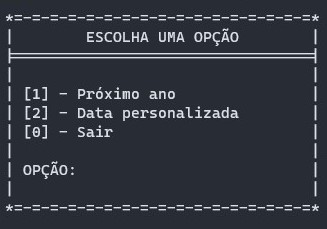
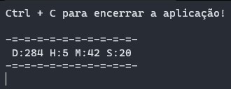
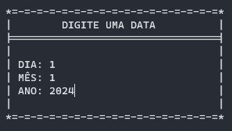
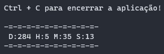

# ⌚Stopwatch-With-Csharp⌚

### Esse é um app dotnet de console, que calcula quanto tempo falta para uma data futura.
---
> para rodar o app você precisar ter o dotnet intalado em sua máquina e execultar o comando ``dotnet run``

**O app tem duas opções:**

``OPÇÃO 1: Calcula a quanto tempo falta até 1º de janeiro do próximo ano.``

``OPÇÃO 2: Calcula quanto tempo falta até uma data futura escolhida pelo usuário.``

===================================

